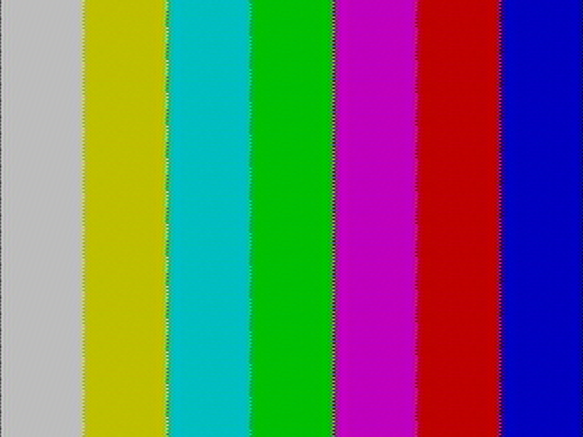

# famicom-rf-hackrf-decoder

ファミコンの VHF RF 出力（NTSC-J）を HackRF One で受信し、リアルタイムに
NTSC カラーデコードして PC に表示するソフトウェアデコーダです。
C++20 + libhackrf + SDL2。GNU Radio 不要。



## 対応チャンネル

| チャンネル | 映像キャリア | 音声キャリア (FM) |
|---|---|---|
| 日本 VHF 1ch | 91.25 MHz | 95.75 MHz |
| 日本 VHF 2ch | 97.25 MHz | 101.75 MHz |

HackRF は DC スパイク回避のため映像キャリア +2.0 MHz にオフセット
チューニングし（1ch → 93.25 MHz）、内部でシフトして復調します。

## ビルド

```sh
brew install hackrf sdl2 cmake pkg-config
cmake -B build -DCMAKE_BUILD_TYPE=Release
cmake --build build -j
```

## 使い方

```sh
# ファミコン(1ch設定)をライブ表示
./build/famidec --channel 1

# 2ch / 任意周波数
./build/famidec --channel 2
./build/famidec --freq 91.25e6

# まずスペクトラムで信号確認（映像キャリアが -2.0 MHz に見えるはず）
./build/famidec --channel 1 --spectrum

# 受信しながら IQ を録画
./build/famidec --channel 1 --record cap.cs8

# 録画ファイルからデコード（hackrf_transfer の .cs8 も可）
./build/famidec --input file --file cap.cs8 --loop

# ヘッドレスでフレームを PPM 出力
./build/famidec --input file --file cap.cs8 --dump-frames out_ --frames 30
```

主なオプション: `--lna N`(0-40) `--vga N`(0-62) `--amp` ゲイン設定、
`--mode color|gray`、`--detector envelope|sync`（同期検波）、
`--sat F` / `--hue DEG` 色調整、`--dump-composite f.f32` デバッグ用
コンポジット出力。

キー操作: `q`/ESC 終了、`l`/`L` LNA ±、`g`/`G` VGA ±、`c` カラー切替、
`s` スクリーンショット(BMP)。左上の OSD: 緑■=ラインPLLロック、
2つ目の■=バースト検出、バー=リングバッファ充填率。

### hackrf_transfer での録画例（1ch）

```sh
hackrf_transfer -r ch1.cs8 -f 93250000 -s 10000000 -b 8000000 -l 24 -g 20 -n 100000000
```

## 仕組み

10 MSPS で受信 → 複素 DC ブロッカ → +2.0 MHz ミキサで映像キャリアを
0 Hz へ → 4.3 MHz LPF → AM 検波（包絡線 or キャリア PLL 同期検波）→
AGC（同期チップ/ペデスタル追跡で IRE 正規化）→ 同期分離 +
フライホイール式ライン PLL → ライン毎カラーバースト位相測定 →
クロマ QAM 復調（U/V）→ YUV→RGB → 640×480 フレーム → SDL 表示。

ファミコンは放送規格非準拠（ノンインターレース 240p、クロマ位相が
ライン毎に 120° 回転、フレーム毎の短ライン）のため、
Y/C 分離はラインコムではなく帯域分離、vsync は等化パルスを要求しない
「長パルス領域」検出、バーストはライン毎に独立測定しています。

## テスト

```sh
./build/synth_ntsc            # 合成カラーバー IQ → デコード → RGB 検証
./build/synth_ntsc bars.cs8   # 合成 IQ を .cs8 に書き出し（E2Eテスト用）
ctest --test-dir build
```

## スレッド構成

USB コールバック（SPSC リングへ push のみ）→ DSP スレッド（復調〜
フレーム生成、トリプルバッファへ publish）→ メインスレッド（SDL 描画）。
Apple Silicon で 10 MSPS 実測 約13倍のリアルタイム余裕があります。
